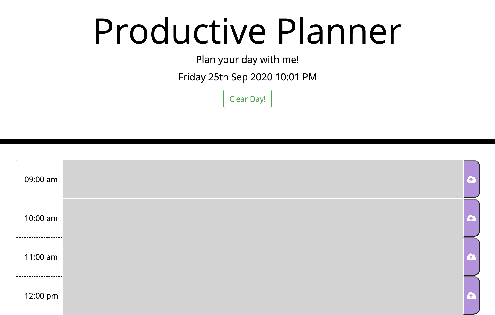

# Productive-Planner

Plan your work day with this web planner! From the moment you clock-in to the second you clock-out, type out all your tasks through the day and save them for later. This web planner will remember your tasks for you if you don't! If you want to start fresh, just hit "Clear Day"

This web application consists of: 
 - Time slots from 9am-7pm
 - Text area for tasks
 - Present time and day
 - A 'Save' button
 - 'Clear Day' button

 ## Web application Image

 

 
 ## Built With
* HTML
* CSS
* JavaScript 
* JQuery
* Moment.js
* Git - version control system to track changes to source code
* GitHub - hosts repository that can be deployed to GitHub Pages

## Deployed Link

* [See Live Site](https://leslievill.github.io/Productive-Planner/)

## Authors

* **Leslie Villatoro** 
- [Link to Github](https://github.com/leslievill)
- [Link to LinkedIn](www.linkedin.com/in/leslie-villatoro-a3632a1a3)

## License

This project is licensed under the MIT License 
